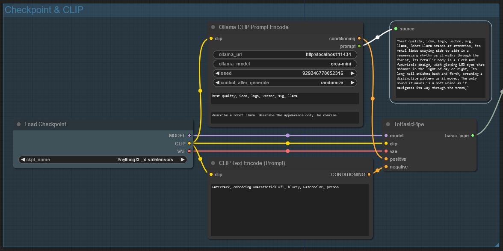

# ComfyUI Ollama Prompt Encode 

** forked to provide a personalized version that will work with Flux Models

The original version of these nodes was set up for tags and short descriptive words.  Flux excels at natural language interpretation.

Being that i almost exclusively use Flux - here we are.

A prompt generator and CLIP encoder using AI provided by [Ollama](https://ollama.com).



## Prerequisites

Install [Ollama](https://ollama.com) and have the service running.

This node has been tested with ollama version `0.1.42`.

## Installation

Choose one of the following methods to install the node:

### via ComfyUI Manager

If you have the [ComfyUI Manager](https://github.com/ltdrdata/ComfyUI-Manager) installed, you can install the node from the `install via git url`.

### via Git

Clone this repository into your `<comfyui>/custom_nodes` directory.

```sh
cd <comfyui>/custom_nodes
git clone https://github.com/ScreamingHawk/comfyui-ollama-prompt-encode](https://github.com/Bob-Harper/comfyui-ollama-flux-encode)
```

## Usage


The `Ollama CLIP Prompt Encode` node is designed to replace the default `CLIP Text Encode (Prompt)` node. It generates a prompt using the Ollama AI model and then encodes the prompt with CLIP.

The node will output the generated prompt as a `string`. This can be viewed with a node that will display text.  i prefer pyssssss "Show Text"

An [example workflow](./docs/ollama_basic_workflow.json) is available in the `docs` folder.

### Ollama URL

The URL to the Ollama service. The default is `http://localhost:11434`.

### Ollama Model

This is the model that is used to generate your prompt.

Some models that work well with this prompt generator are:

- `orca-mini`
- `mistral`
- `tinyllama`

~~The node will automatically download the model if it is not already present on your system.~~

*** Not a fan. Too easy to typo if you want a different model, and the model name for orca was hardcoded.

That means retyping the model name every time you create a new flow.

Everytime I ran the flow it kept trying to download a model I already had.  That broke the generation.  

So I switched it up so the node will now show you the currently installed models in dropdown.  

Want a new model?  Install with ollama pull in the CLI.  

That's an idea - make a custom node that will manage models without leaving Comfy.  Pin that, for sure.

Smaller models are recommended for faster generation times.

### Seed

The seed that will be used to generate the prompt. This is useful for generating the same prompt multiple times or ensuring a different prompt is generated each time.

### Prepend Tags

~~A string that will be prepended to the generated prompt.~~

~~This is useful for models like `pony` that work best with extra tags like `score_9, score_8_up`.~~

Not anymore, not a fan of hardcoding values that would benefit from dynamic generation.  

It does have a hardcoded system value now, targeted for FLux style prompting.  

But it will load the system prompt instead of prepend which is no longer used, sine FLux doesn't need tags.

Any edits to the system prompt in the text box will override the default.

This should allow for future changes to prompting methods without needing to recode. 

*** speaking of future prompting - idea, some models use "user:content", some use <|user|> style.  

maybe have a "paste your model's model card prompt example here" node and an optional connector.

### Text

The text that will be used by the AI model to generate the prompt.

## Testing

Run the tests with:

```sh
python -m unittest
```

## Credits

(credit where it is due, of course.  I may have my preferences and ideas on improvements, but this wouldn't exist without a solid implementation to work from.)

[Michael Standen](https://michael.standen.link)

This software is provided under the [MIT License](https://tldrlegal.com/license/mit-license) so it's free to use so long as you give me credit.
